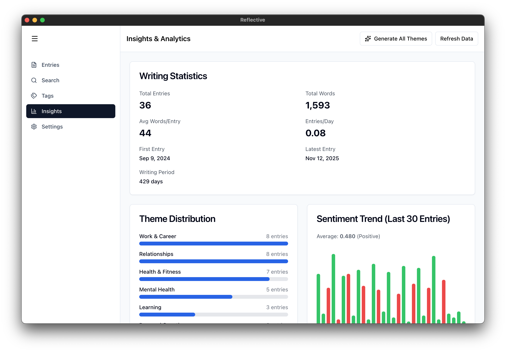

# Reflective

A privacy-first journaling application that runs entirely on your computer. Write, search, and analyze your thoughts with AI-powered insights while maintaining complete control over your data.

\>> [Live Demo](https://youtu.be/5khCanOZAhw) <<

\>> [Reflective Server](https://github.com/teatime-co/Reflective-Server) <<

## Screenshots

### Entries


### Search


### Insights


### Settings/Sync


## The Problem

Traditional journaling apps force an impossible choice: trust cloud providers with your most intimate thoughts or forgo modern conveniences like search, AI insights, and multi-device sync. As data breaches become increasingly common and privacy concerns mount, personal journaling has become a digital minefield.

**The core challenge**: How do we provide the convenience and intelligence of modern cloud applications while preserving the privacy and control of local-first software?

## The Solution

Reflective is a **privacy-first journaling app** where your data lives on your computer by default. All AI features—semantic search, theme detection, sentiment analysis—run locally using on-device models, ensuring complete privacy.

#### Choose Your Privacy Level

| Privacy Tier | What Syncs | Best For |
|-------------|------------|----------|
| **LOCAL_ONLY** | Nothing | Maximum privacy, single device |
| **ANALYTICS_SYNC** | Encrypted metrics only | Cross-device insights, content stays local |
| **FULL_SYNC** | Encrypted entries | Multi-device access with zero-knowledge sync |

**Your keys, your data**: Even with full sync enabled, your encryption keys are stored in your operating system's secure keychain and never leave your device. The server stores only encrypted blobs it cannot read.

## Core Features

### Journaling Experience
- **Rich Text Editor** with formatting controls and auto-save
- **Tag System** with colored tags and organization
- **Timeline View** showing all entries chronologically
- **Real-Time Word Count** and writing statistics

### AI-Powered Intelligence
- **Semantic Search**: Find entries by meaning, not just keywords
- **Theme Detection**: Automatic classification across 10 life categories (Personal Growth, Relationships, Work & Career, Mental Health, and more)
- **Sentiment Analysis**: Track emotional patterns over time
- **Keyword Extraction**: Discover important topics without manual tagging
- **Insights Dashboard**: Visualize theme distribution, sentiment trends, and writing patterns

### Privacy & Security
- **End-to-End Encryption** using AES-256-GCM
- **Homomorphic Encryption** for privacy-preserving analytics
- **OS Keychain Integration** for secure key storage
- **Zero-Knowledge Architecture** - the server never sees your encryption keys
- **Progressive Privacy Tiers** - you control what data leaves your device

### Multi-Device Sync
- **Conflict Resolution** with side-by-side diff view
- **Visual Comparison Tools** for merging changes
- **Sync Status Monitoring** with clear indicators
- **Privacy-Aware Syncing** based on your chosen tier

## Technology Overview

Built with **Electron**, **React**, and **TypeScript**, Reflective uses:
- Local **SQLite database** for offline-capable storage
- **Python service** for AI embeddings (All-MiniLM-L6-v2)
- **Ollama** for local theme generation (llama3.2)
- **OS keychain** for secure encryption key storage

All AI processing happens on your device. No data leaves your computer unless you explicitly enable sync.


## Getting Started

### Prerequisites
- Node.js 18+ and npm
- macOS 12+ (for OS keychain integration)
- Ollama (for theme generation) - [Install from ollama.ai](https://ollama.ai)

### Installation

```bash
cd reflective-web
npm install
```

### Setup Ollama

```bash
ollama pull llama3.2
```

### Development

```bash
npm run dev
```

### Build

```bash
npm run build
```

Output will be in `out/main/`, `out/preload/`, `out/renderer/`

## Demo Data

For testing and demonstrations, we provide scripts to populate the application with sample data:

### Local-Only Demo

```bash
./scripts/dev-reset.sh
npm run dev

# In another terminal, after app starts:
node scripts/seed-demo-data.js
```

This creates 35 realistic journal entries across a 60-day timeline with pre-generated themes, tags, and sentiment scores.

### Synced Demo (with Backend)

Requires the backend server running. See [reflective-server/README.md](../reflective-server/README.md) for setup.

```bash
# Reset backend first (in reflective-server directory):
cd ../reflective-server
python dev_reset.py

# Then reset frontend with auth:
cd ../reflective-web
./scripts/dev-reset.sh
node scripts/seed-demo-data-authed.js
npm run dev
```

For more details, see [scripts/README.md](scripts/README.md).

## Project Structure

```
reflective-web/
├── src/
│   ├── main/          # Electron main process (database, encryption, sync, AI)
│   ├── preload/       # Secure IPC bridge
│   ├── renderer/      # React UI (pages, components, stores)
│   └── types/         # Shared TypeScript types
├── python-service/    # FastAPI embedding server
├── scripts/           # Development and seeding scripts
└── package.json
```

## Documentation

For detailed technical documentation, architecture diagrams, and implementation details, see [ARCHITECTURE.md](./ARCHITECTURE.md).
