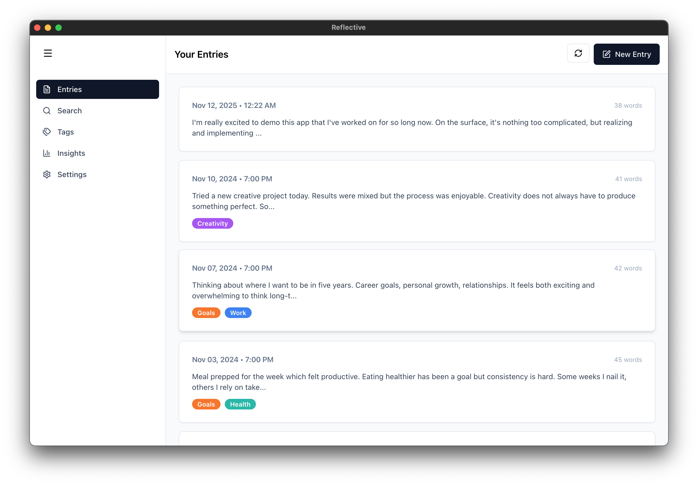
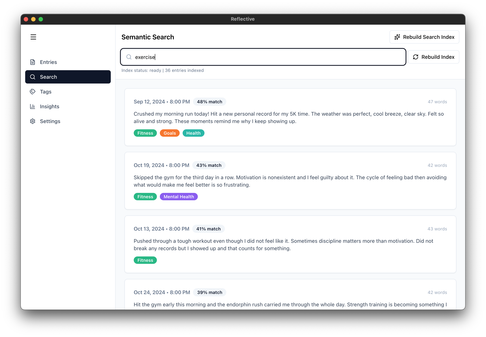
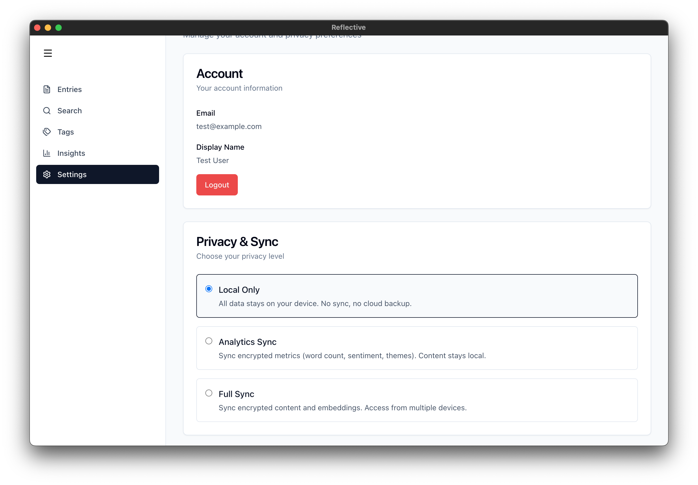

# Reflective Web Client

A local-first, AI-powered journaling application built with Electron, React, and TypeScript. Features end-to-end encryption, semantic search, and multi-device sync with conflict resolution.

[Demo Video](https://youtu.be/5khCanOZAhw)

Entries



Search



Insights


Settings/Sync



## Features

### Core Journaling

- **Rich Text Editor**: TipTap-based editor with formatting controls (bold, italic, headings, lists, blockquotes)
- **Tag System**: Colored tags with management interface and usage tracking
- **Auto-Save**: 3-second debounced auto-save with change detection
- **Timeline View**: Chronological list of entries with metadata (date, word count, tags)
- **Entry Management**: Full CRUD operations with UUID-based entry IDs
- **Real-Time Word Count**: Updates as you type

### AI & Analytics

- **Semantic Search**: Vector-based search using All-MiniLM-L6-v2 embeddings (384 dimensions)
  - HNSW index for fast k-NN search
  - Background embedding generation
  - Similarity scoring with percentage match display
- **Theme Generation**: AI-powered theme detection via Ollama (llama3.2)
  - 10 predefined themes: Personal Growth, Relationships, Work & Career, Health & Fitness, Mental Health, Travel & Adventure, Creativity, Learning, Gratitude, Challenges & Struggles
  - Confidence-based filtering (>0.3 threshold)
  - Bulk generation with progress tracking
- **Sentiment Analysis**: AFINN-based sentiment scoring (-1 to 1)
  - Auto-generated on entry save
  - Color-coded badges in editor
- **Keyword Extraction**: NLP-based keyword extraction using Compromise
  - Topic, verb, and noun extraction
  - Stop word filtering
- **Insights Dashboard**:
  - Theme distribution chart
  - Sentiment trend visualization (last 30 entries)
  - Top keywords cloud
  - Writing statistics (total entries, word count, date range)

### Security & Privacy

- **End-to-End Encryption**:
  - AES-256-GCM symmetric encryption for entry content
  - CKKS homomorphic encryption for aggregated metrics
  - 12-byte random IV generation (never reused)
  - Authentication tags for tamper detection
- **OS Keychain Integration**: Secure key storage via keytar (macOS Keychain)
- **Privacy Tiers**: Three modes for data control
  - **LOCAL_ONLY**: All data stays on device, no sync
  - **ANALYTICS_SYNC**: Encrypted metrics only (word count, sentiment, themes)
  - **FULL_SYNC**: Full encrypted content + embeddings for multi-device access
- **Authentication**: JWT token-based auth with secure token storage
- **SQL Injection Prevention**: Prepared statements and input validation on all database operations

### Sync & Conflict Resolution

- **Multi-Device Sync**: Background sync queue with 30-second intervals
- **Retry Logic**: Exponential backoff (1s, 2s, 4s) with max 3 retry attempts
- **Conflict Detection**: HTTP 409 response detection from backend
- **Conflict Resolution UI**:
  - Side-by-side diff view with word-level highlighting
  - Three resolution strategies: Keep local, Keep remote, Merge manually
  - Metadata comparison (timestamp, word count, device ID)
  - Real-time conflict count badges
- **Sync Status Monitoring**:
  - Visual status indicators (idle/syncing/error/success)
  - Pending and failed operation counters
  - Last sync time display
  - Manual sync trigger
- **Privacy-Aware**: Sync enforcement based on privacy tier

## Privacy Tiers

Reflective offers three privacy modes to control how your data is stored and synced:

| Tier | Description | Data Synced | Use Case |
|------|-------------|-------------|----------|
| **LOCAL_ONLY** | All data stays on your device | None | Maximum privacy, single device |
| **ANALYTICS_SYNC** | Encrypted metrics only | Word count, sentiment scores, themes | Insights across devices, content stays local |
| **FULL_SYNC** | Full encrypted content | All encrypted entries + embeddings | Multi-device access, cloud backup |

Tier transitions automatically migrate data (e.g., downgrading from FULL_SYNC to ANALYTICS_SYNC deletes encrypted content from server).

## Technical Stack

### Core Technologies
- **Electron** 33.4.11 - Cross-platform desktop application framework
- **React** 18.3.1 - UI framework
- **TypeScript** 5.9.3 - Type-safe development
- **Vite** 5.4.21 + electron-vite 2.3.0 - Fast build tooling
- **Tailwind CSS** 3.4.18 - Utility-first styling
- **Zustand** 5.0.8 - State management

### Database & Storage
- **better-sqlite3** 11.10.0 - Synchronous SQLite bindings
- **electron-store** 10.0.0 - Persistent settings storage
- **Database Location**: `~/Library/Application Support/reflective/database.db` (macOS)

### AI & ML Libraries
- **@xenova/transformers** 2.17.2 - Embedding generation (All-MiniLM-L6-v2)
- **hnswlib-node** 3.0.0 - Vector index for semantic search
- **sentiment** 5.0.2 - Sentiment analysis
- **compromise** 14.14.4 - NLP keyword extraction
- **Ollama API** - Theme generation via llama3.2 model

### Security & Encryption
- **keytar** 7.9.0 - OS keychain integration
- **node-seal** 4.0.0 - CKKS homomorphic encryption
- **crypto** (Node.js built-in) - AES-256-GCM encryption

### UI Components
- **TipTap** 2.27.1 - Rich text editor
- **shadcn/ui** - Component library (Button, Input, Card, Badge, etc.)
- **React Router** 6.30.1 - Client-side routing
- **lucide-react** - Icon library
- **diff** 5.1.0 - Text diffing for conflict resolution
- **sonner** 1.0.0 - Toast notifications

## Architecture

### Database Schema

7 tables with foreign key constraints and performance indexes:

- **entries**: Journal entries with content, word count, sentiment score, timestamps, encryption metadata
- **tags**: Tag definitions with name, color, usage tracking
- **entry_tags**: Many-to-many junction table
- **themes**: AI-generated themes linked to entries with confidence scores
- **sync_queue**: Background sync operations with retry tracking
- **conflicts**: Sync conflicts with encrypted local/remote versions

Schema versioning via migrations (v1-v5) with user_version pragma.

### State Management

9 Zustand stores:
- `useEntriesStore` - Entry CRUD + embeddings
- `useTagsStore` - Tag management
- `useEmbeddingsStore` - Semantic search
- `useThemesStore` - Theme generation
- `useSyncStore` - Sync queue operations
- `useAuthStore` - Authentication state
- `useConflictsStore` - Conflict resolution
- `useSettingsStore` - App settings
- `useUIStore` - UI state (sidebar, visited entries)

### IPC Architecture

Secure Electron IPC with contextIsolation:
- **Main Process**: Database operations, encryption, sync worker, ML operations
- **Preload Bridge**: Type-safe IPC methods exposed via `window.electronAPI`
- **Renderer Process**: React app with API access via preload bridge

IPC namespaces: `db`, `embeddings`, `ml`, `crypto`, `sync`, `auth`, `conflicts`, `settings`

### Encryption Flow

1. **Key Generation**: 32-byte AES key stored in OS keychain
2. **Encryption**: Content � AES-256-GCM � {encrypted, iv, authTag}
3. **Storage**: Encrypted data stored in SQLite as BLOB
4. **Sync**: Encrypted payload sent to backend (never plaintext)
5. **Decryption**: Retrieve from keychain � decrypt � display

## Getting Started

### Prerequisites

- Node.js 18+ and npm
- macOS 12+ (for OS keychain integration)
- Ollama (for theme generation) - Install from https://ollama.ai

### Installation

```bash
cd reflective-web
npm install
```

Native modules (better-sqlite3, keytar) will be automatically rebuilt for Electron.

### Setup Ollama

```bash
# Install Ollama, then pull the llama3.2 model
ollama pull llama3.2
```

### Development

```bash
# Run in development mode
npm run dev
```

This starts the Electron app with hot module reloading.

### Build

```bash
# Build for production
npm run build
```

Output: `out/main/`, `out/preload/`, `out/renderer/`

### Development Reset & Demo Data

For testing and demos, scripts are provided to reset the database with pre-populated data:

#### Option 1: Local-Only Demo (No Backend)

```bash
# Reset database and load 35 demo entries locally
./scripts/dev-reset.sh
npm run dev

# In another terminal, after app starts:
node scripts/seed-demo-data.js
```

This gives you a fully-featured local journaling app with:
- 35 diverse journal entries (60-day timeline)
- 10 pre-tagged categories
- Pre-generated themes and sentiment scores
- Ready for semantic search, insights, and analytics

**Use this when**: Demonstrating local-first features without backend sync.

#### Option 2: Synced Demo (With Backend)

Prerequisites:
- Backend server running (`reflective-server`)
- Test account created (see [reflective-server/README.md](../reflective-server/README.md))

```bash
# Reset backend first (in reflective-server directory):
cd ../reflective-server
python dev_reset.py    # Creates test@example.com account

# Then reset frontend with auth:
cd ../reflective-web
./scripts/dev-reset.sh
node scripts/seed-demo-data-authed.js
npm run dev
```

This configures:
- Pre-login as test@example.com
- Privacy tier set to FULL_SYNC
- 35 entries ready to sync to backend
- Automatic sync on app start (30-second cycle)

**Use this when**: Demonstrating multi-device sync, conflict resolution, or privacy tiers.

#### Reset Scripts

- `dev-reset.sh` - Resets local database only
- `seed-demo-data.js` - Loads demo entries (local-only mode)
- `seed-demo-data-authed.js` - Loads demo entries + configures auth
- `dev-reset-synced.sh` - Automated full reset (frontend + backend)

See [scripts/README.md](scripts/README.md) for detailed documentation.

## Project Structure

```
reflective-web/
 src/
    main/
       database/
       embeddings/
       crypto/
       sync/
       settings/
       ipc/
    preload/
    renderer/
       pages/
       components/
       stores/
       api/
       utils/
    types/
 scripts/
 electron-vite.config.ts
 package.json
```

## Backend Integration

Reflective syncs with a FastAPI backend (reflective-server) for multi-device support:

- **Authentication**: POST `/api/auth/register`, `/api/auth/login`
- **Sync**: POST `/api/sync/backup`, GET `/api/sync/backups`, DELETE `/api/sync/backup/content`
- **Conflicts**: GET `/api/sync/conflicts`, POST `/api/sync/conflicts/:id/resolve`
- **Encryption Context**: GET `/api/encryption/context` (for CKKS parameters)

Backend URL configurable in Settings page (default: `http://localhost:8000`).

## Development Notes

### Security Considerations
- Never log encryption keys or auth tokens
- Always use prepared statements for SQL queries
- Validate all IPC handler inputs
- Clear sensitive data from memory after use
- Use OS keychain for persistent key storage

### Performance
- Embedding generation: ~500ms per entry (background)
- Theme generation: ~1-3s per entry via Ollama
- Sentiment analysis: <10ms per entry
- Keyword extraction: ~50ms per entry
- Search query: <100ms with HNSW index

### Build Output
- Main process: ~1.5 MB
- Renderer process: ~1.1 MB
- CSS: ~46 KB

## License

Copyright 2025. All rights reserved.
